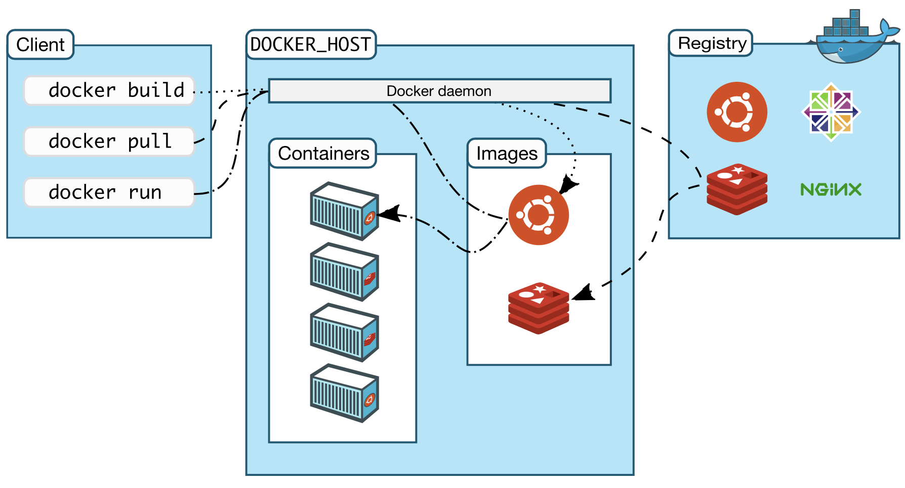

# Docker

Docker是一个用于开发，交付和运行应用程序的开放平台。 Docker使您能够将应用程序与基础架构分开，从而可以快速交付软件。借助Docker，您可以以与管理应用程序相同的方式来管理基础架构。通过利用Docker的快速交付，测试和部署代码的方法，您可以大大减少编写代码和在生产环境中运行代码之间的延迟。

## Docker平台

Docker通过容器\(container\)实现在松散封闭环境中包装及运行程序。Docker隔离和安全的特性使得我们可以同时在一个主机上同时运行多个容器。容器是轻量级，因为他不需要额外的监管程序，但是他直接运行在机器内核的。这意味着与使用虚拟机相比，在给定的硬件组合上可以运行更多的容器。您甚至可以在实际上是虚拟机的主机中运行Docker容器。

Docker提供了工具和平台来管理容器的生命周期：

* 使用容器开发应用程序及其支持组件。
* 容器成为分发和测试您的应用程序的单元。
* 准备就绪后，可以将应用程序作为容器或协调服务部署到生产环境中。无论您的生产环境是本地数据中心，云提供商还是两者的混合，其工作原理都相同。

## Docker引擎

Docker引擎是一个client-server应用，其中包含下列部件：

* 服务器是一种长期运行的程序，称为守护进程。
* REST API，它指定程序可以用来与守护程序进行通信并指示其操作的接口。
* 命令行界面\(CLI\)

CLI通过REST API对Docker守护线程进行交互或控制。守护线程负责创建与管理Docker对象，如image、container、network和volume。

## Docker可以用来做什么

### 持续交付程序

Docker的流线型开发生命周期使得开发者可以在不同环境中用容器发布程序与服务。容器同时也便于持续集成与持续交付。

例子场景：

* 开发者在本地写的代码可以通过Docker容器分享给同事。
* 开发者可以使用Docker将程序放到测试环境进行手动或自动测试。
* 开发者可以很方便的在自己换环境调试bug，完成后在测试环境中验证。
* 当测试通过后，可以很方便的通过容器将程序推送到生产环境。

### 响应式部署和扩展

Docker基于容器的平台实现了高度可移植的负载。Docker容器可以在开发者的电脑、数据中心的物理或虚拟设备、云服务提供者、复合环境等环境上运行。

Docker的可移植性以及轻量化特性使得可以很容易的动态管理负载，以及以近乎实时根据业务的需要扩大或缩小程序与服务的规模。

### **可以在同一个硬件上跑更多的负载**

Docker是轻量级以及快速的，它提供一个可行和低成本的方法替换基于超管理器的虚拟机，所以开发者可以获得更多算力去实现他们的业务。Docker非常适合高密度环境以及中型或小型的的部署，它可以使用有限的资源来实现更多的事情。

## Docker的架构

Docker uses a client-server architecture. The Docker _client_ talks to the Docker _daemon_, which does the heavy lifting of building, running, and distributing your Docker containers. The Docker client and daemon _can_ run on the same system, or you can connect a Docker client to a remote Docker daemon. The Docker client and daemon communicate using a REST API, over UNIX sockets or a network interface.

### The Docker daemon

The Docker daemon \(`dockerd`\) listens for Docker API requests and manages Docker objects such as images, containers, networks, and volumes. A daemon can also communicate with other daemons to manage Docker services.

### The Docker client

The Docker client \(`docker`\) is the primary way that many Docker users interact with Docker. When you use commands such as `docker run`, the client sends these commands to `dockerd`, which carries them out. The `docker` command uses the Docker API. The Docker client can communicate with more than one daemon.

### Docker registries

A Docker _registry_ stores Docker images. Docker Hub is a public registry that anyone can use, and Docker is configured to look for images on Docker Hub by default. You can even run your own private registry.

When you use the `docker pull` or `docker run` commands, the required images are pulled from your configured registry. When you use the `docker push` command, your image is pushed to your configured registry.

### Docker objects

When you use Docker, you are creating and using images, containers, networks, volumes, plugins, and other objects. This section is a brief overview of some of those objects.

#### **IMAGES**

An _image_ is a read-only template with instructions for creating a Docker container. Often, an image is _based on_ another image, with some additional customization. For example, you may build an image which is based on the `ubuntu` image, but installs the Apache web server and your application, as well as the configuration details needed to make your application run.

You might create your own images or you might only use those created by others and published in a registry. To build your own image, you create a _Dockerfile_ with a simple syntax for defining the steps needed to create the image and run it. Each instruction in a Dockerfile creates a layer in the image. When you change the Dockerfile and rebuild the image, only those layers which have changed are rebuilt. This is part of what makes images so lightweight, small, and fast, when compared to other virtualization technologies.

#### **CONTAINERS**

A container is a runnable instance of an image. You can create, start, stop, move, or delete a container using the Docker API or CLI. You can connect a container to one or more networks, attach storage to it, or even create a new image based on its current state.

By default, a container is relatively well isolated from other containers and its host machine. You can control how isolated a container’s network, storage, or other underlying subsystems are from other containers or from the host machine.

A container is defined by its image as well as any configuration options you provide to it when you create or start it. When a container is removed, any changes to its state that are not stored in persistent storage disappear.

#### **SERVICES**

Services allow you to scale containers across multiple Docker daemons, which all work together as a _swarm_ with multiple _managers_and _workers_. Each member of a swarm is a Docker daemon, and all the daemons communicate using the Docker API. A service allows you to define the desired state, such as the number of replicas of the service that must be available at any given time. By default, the service is load-balanced across all worker nodes. To the consumer, the Docker service appears to be a single application. Docker Engine supports swarm mode in Docker 1.12 and higher.

**参考资料：**

* \*\*\*\*[**Docker overview**](https://docs.docker.com/get-started/overview/)\*\*\*\*

