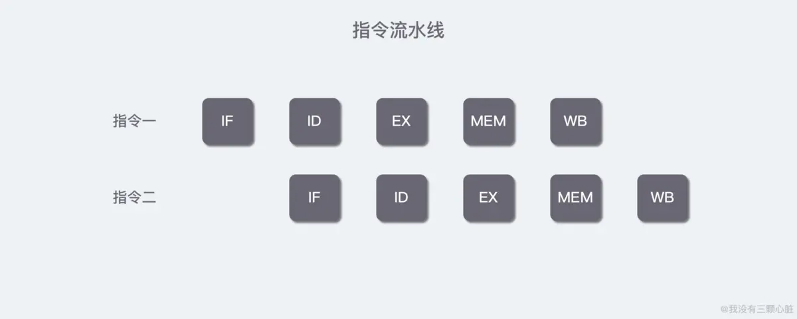

# 概述

## 一、前言 <a id="toc-heading-1"></a>

当我们使用计算机时，可以同时做许多事情，例如一边打游戏一边听音乐。这是因为操作系统支持并发任务，从而使得这些工作得以同时进行。

* **那么提出一个问题**：如果我们要实现一个程序能一边听音乐一边玩游戏怎么实现呢？

```java
public class Tester {

    public static void main(String[] args) {
        System.out.println("开始....");
        playGame();
        playMusic();
        System.out.println("结束....");
    }

    private static void playGame() {
        for (int i = 0; i < 50; i++) {
            System.out.println("玩游戏" + i);
        }
    }

    private static void playMusic() {
        for (int i = 0; i < 50; i++) {
            System.out.println("播放音乐" + i);
        }
    }
}
```

我们使用了循环来模拟过程，因为播放音乐和打游戏都是连续的，但是结果却不尽人意，因为函数体总是要执行完之后才能返回。那么到底怎么解决这个问题？

### 并行与并发 <a id="toc-heading-2"></a>


并行性和并发性是既相似又有区别的两个概念。

**并行性是指两个或多个事件在同一时刻发生。而并发性是指两个或多个事件在同一时间间隔内发生。**

在多道程序环境下，并发性是指在一段时间内宏观上有多个程序在同时运行，但在单处理机环境下（一个处理器），每一时刻却仅能有一道程序执行，故微观上这些程序只能是分时地交替执行。例如，在 1 秒钟时间内，0 - 15 ms 程序 A 运行；15 - 30 ms 程序 B 运行；30 - 45 ms 程序 C 运行；45 - 60 ms 程序 D 运行，因此可以说，在 1 秒钟时间间隔内，宏观上有四道程序在同时运行，但微观上，程序 A、B、C、D 是分时地交替执行的。

如果在计算机系统中有多个处理机，这些可以并发执行的程序就可以被分配到多个处理机上，实现并发执行，即利用每个处理机爱处理一个可并发执行的程序。这样，多个程序便可以同时执行。以此就能提高系统中的资源利用率，增加系统的吞吐量。

### 进程和线程 <a id="toc-heading-3"></a>

**进程是指一个内存中运行的应用程序**。一个应用程序可以同时启动多个线程，那么上面的问题就有了解决的思路：**我们启动两个进程，一个用来打游戏，一个用来播放音乐**。这当然是一种解决方案，但是想象一下，如果一个应用程序需要执行的任务非常多，例如 LOL 游戏吧，光是需要播放的音乐就有非常多，人物本身的语音，技能的音效，游戏的背景音乐，塔攻击的声音等等等，还不用说游戏本身，就光播放音乐就需要创建许多许多的进程，而进程本身是一种非常消耗资源的东西，这样的设计显然是不合理的。更何况大多数的操作系统都不需要一个进程访问其他进程的内存空间，**也就是说，进程之间的通信很不方便，此时我们就得引入“线程”这门技术，来解决这个问题。**

**线程是指进程中的一个执行任务（控制单元），一个进程可以同时并发运行多个线程**。我们可以打开任务管理器，观察到几乎所有的进程都拥有着许多的「线程」\(在 WINDOWS 中线程是默认隐藏的，需要在「查看」里面点击「选择列」，有一个线程数的勾选项，找到并勾选就可以了\)。


### 进程和线程的区别 <a id="toc-heading-4"></a>

**进程**：有独立的内存空间，进程中的数据存放空间（堆空间和栈空间）是独立的，至少有一个线程。

**线程**：堆空间是共享的，栈空间是独立的，线程消耗的资源也比进程小，相互之间可以影响的，又称为轻型进程或进程元。

因为一个进程中的多个线程是并发运行的，那么从微观角度上考虑也是有先后顺序的，**那么哪个线程执行完全取决于 CPU 调度器\(JVM 来调度\)**，程序员是控制不了的。我们可以把多线程并发性看作是多个线程在瞬间抢 CPU 资源，谁抢到资源谁就运行，这也造就了**多线程的随机性**。下面我们将看到更生动的例子。

Java 程序的进程\(Java 的一个程序运行在系统中\)里至少包含主线程和垃圾回收线程\(后台线程\)，你可以简单的这样认为，但实际上有四个线程（了解就好）：

* main——main 线程，用户程序入口
* Reference Handler——清除 Reference 的线程
* Finalizer——调用对象 finalize 方法的线程
* Signal Dispatcher——分发处理发送给 JVM 信号的线程

### 多线程和单线程的区别和联系？ <a id="toc-heading-5"></a>

1. 单核 CPU 中，将 CPU 分为很小的时间片，在每一时刻只能有一个线程在执行，是一种微观上轮流占用 CPU 的机制。
2. 多线程会存在线程上下文切换，会导致程序执行速度变慢，即采用一个拥有两个线程的进程执行所需要的时间比一个线程的进程执行两次所需要的时间要多一些。

**结论：即采用多线程不会提高程序的执行速度，反而会降低速度，但是对于用户来说，可以减少用户的响应时间。**

### 多线程的优势 <a id="toc-heading-6"></a>

尽管面临很多挑战，多线程有一些优点仍然使得它一直被使用，而这些优点我们应该了解。

#### 优势一：资源利用率更好 <a id="toc-heading-7"></a>

想象一下，一个应用程序需要从本地文件系统中读取和处理文件的情景。比方说，从磁盘读取一个文件需要 5 秒，处理一个文件需要 2 秒。处理两个文件则需要：

```text
1| 5秒读取文件A
2| 2秒处理文件A
3| 5秒读取文件B
4| 2秒处理文件B
5| ---------------------
6| 总共需要14秒
```

从磁盘中读取文件的时候，大部分的 CPU 时间用于等待磁盘去读取数据。在这段时间里，CPU 非常的空闲。它可以做一些别的事情。通过改变操作的顺序，就能够更好的使用 CPU 资源。看下面的顺序：

```text
1| 5秒读取文件A
2| 5秒读取文件B + 2秒处理文件A
3| 2秒处理文件B
4| ---------------------
5| 总共需要12秒
```

CPU 等待第一个文件被读取完。然后开始读取第二个文件。当第二文件在被读取的时候，CPU 会去处理第一个文件。记住，在等待磁盘读取文件的时候，CPU 大部分时间是空闲的。

总的说来，CPU 能够在等待 IO 的时候做一些其他的事情。这个不一定就是磁盘 IO。它也可以是网络的 IO，或者用户输入。通常情况下，网络和磁盘的 IO 比 CPU 和内存的 IO 慢的多。

#### 优势二：程序设计在某些情况下更简单 <a id="toc-heading-8"></a>

在单线程应用程序中，如果你想编写程序手动处理上面所提到的读取和处理的顺序，你必须记录每个文件读取和处理的状态。相反，你可以启动两个线程，每个线程处理一个文件的读取和操作。线程会在等待磁盘读取文件的过程中被阻塞。在等待的时候，其他的线程能够使用 CPU 去处理已经读取完的文件。其结果就是，磁盘总是在繁忙地读取不同的文件到内存中。这会带来磁盘和 CPU 利用率的提升。而且每个线程只需要记录一个文件，因此这种方式也很容易编程实现。

#### 优势三：程序响应更快 <a id="toc-heading-9"></a>

有时我们会编写一些较为复杂的代码（这里的复杂不是说复杂的算法，而是复杂的业务逻辑），例如，一笔订单的创建，它包括插入订单数据、生成订单赶快找、发送邮件通知卖家和记录货品销售数量等。用户从单击“订购”按钮开始，就要等待这些操作全部完成才能看到订购成功的结果。但是这么多业务操作，如何能够让其更快地完成呢？

在上面的场景中，可以使用多线程技术，即将数据一致性不强的操作派发给其他线程处理（也可以使用消息队列），如生成订单快照、发送邮件等。这样做的好处是响应用户请求的线程能够尽可能快地处理完成，缩短了响应时间，提升了用户体验。

#### 其他优势 <a id="toc-heading-10"></a>

多线程还有一些优势也显而易见：

* 进程之前不能共享内存，而线程之间共享内存\(堆内存\)则很简单。
* 系统创建进程时需要为该进程重新分配系统资源,创建线程则代价小很多,因此实现多任务并发时,多线程效率更高.
* Java 语言本身内置多线程功能的支持,而不是单纯第作为底层系统的调度方式,从而简化了多线程编程.

### 上下文切换 <a id="toc-heading-11"></a>

即使是单核处理器也支持多线程执行代码，CPU 通过给每个线程分配 CPU 时间片来实现这个机制。时间片是 CPU 分配给各个线程的时间，因为时间片非常短，所以 CPU 通过不停地切换线程执行，让我们感觉多个线程是同时执行的，时间片一般是几十毫秒（ms）。

CPU 通过时间片分配算法来循环执行任务，当前任务执行一个时间片后会切换到下一个任务。但是，在切换前会保存上一个任务的状态，以便下次切换回这个任务的时候，可以再加载这个任务的状态。**所以任务从保存到再加载的过程就是一次上下文切换。**

> 这就像我们同时读两本书，当我们在读一本英文的技术书时，发现某个单词不认识，于是打开中英文字典，但是在放下英文技术书之前，大脑必须先记住这本书独到了多少页的多少行，等查完单词之后，能够继续读这本书。这样的切换是会影响读书效率的，同样上下文切换也会影响多线程的执行速度。

## 二、创建线程的两种方式 <a id="toc-heading-12"></a>

### 继承 Thread 类 <a id="toc-heading-13"></a>

```java
public class Tester {

    // 播放音乐的线程类
    static class PlayMusicThread extends Thread {

        // 播放时间，用循环来模拟播放的过程
        private int playTime = 50;

        public void run() {
            for (int i = 0; i < playTime; i++) {
                System.out.println("播放音乐" + i);
            }
        }
    }

    // 方式1：继承 Thread 类
    public static void main(String[] args) {
        // 主线程：运行游戏
        for (int i = 0; i < 50; i++) {
            System.out.println("打游戏" + i);
            if (i == 10) {
                // 创建播放音乐线程
                PlayMusicThread musicThread = new PlayMusicThread();
                musicThread.start();
            }
        }
    }
}
```

运行结果发现打游戏和播放音乐交替出现，说明已经成功了。

### 实现 Runnable 接口 <a id="toc-heading-14"></a>

```java
public class Tester {

    // 播放音乐的线程类
    static class PlayMusicThread implements Runnable {

        // 播放时间，用循环来模拟播放的过程
        private int playTime = 50;

        public void run() {
            for (int i = 0; i < playTime; i++) {
                System.out.println("播放音乐" + i);
            }
        }
    }

    // 方式2：实现 Runnable 方法
    public static void main(String[] args) {
        // 主线程：运行游戏
        for (int i = 0; i < 50; i++) {
            System.out.println("打游戏" + i);
            if (i == 10) {
                // 创建播放音乐线程
                Thread musicThread = new Thread(new PlayMusicThread());
                musicThread.start();
            }
        }
    }
}
```

也能完成效果。

以上就是传统的两种创建线程的方式，事实上还有第三种，我们后边再讲。

### 多线程一定快吗？ <a id="toc-heading-15"></a>

先来一段代码，通过并行和串行来分别执行累加操作，分析：下面的代码并发执行一定比串行执行快吗？

```java
import org.springframework.util.StopWatch;

// 比较并行和串行执行累加操作的速度
public class Tester {

    // 执行次数
    private static final long COUNT = 100000000;
    private static final StopWatch TIMER = new StopWatch();

    public static void main(String[] args) throws InterruptedException {
        concurrency();
        serial();
        // 打印比较测试结果
        System.out.println(TIMER.prettyPrint());
    }

    private static void serial() {
        TIMER.start("串行执行" + COUNT + "条数据");

        int a = 0;
        for (long i = 0; i < COUNT; i++) {
            a += 5;
        }
        // 串行执行
        int b = 0;
        for (long i = 0; i < COUNT; i++) {
            b--;
        }

        TIMER.stop();
    }

    private static void concurrency() throws InterruptedException {
        TIMER.start("并行执行" + COUNT + "条数据");

        // 通过匿名内部类来创建线程
        Thread thread = new Thread(() -> {
            int a = 0;
            for (long i = 0; i < COUNT; i++) {
                a += 5;
            }
        });
        thread.start();

        // 并行执行
        int b = 0;
        for (long i = 0; i < COUNT; i++) {
            b--;
        }
        // 等待线程结束
        thread.join();
        TIMER.stop();
    }
}
```

大家可以自己测试一下，每一台机器 CPU 不同测试结果可能也会不同，之前在 WINDOWS 本儿上测试的时候，多线程的优势从 1 千万数据的时候才开始体现出来，但是现在换了 MAC，1 亿条数据时间也差不多，到 10 亿的时候明显串行就比并行快了… 总之，为什么并发执行的速度会比串行慢呢？就是因为线程有创建和上下文切换的开销。

### 继承Thread类还是实现Runnable接口？ <a id="toc-heading-16"></a>

想象一个这样的例子：给出一共 50 个苹果，让三个同学一起来吃，并且给苹果编上号码，让他们吃的时候顺便要说出苹果的编号：


运行结果可以看到，使用继承方式实现，每一个线程都吃了 50 个苹果。这样的结果显而易见：是因为显式地创建了三个不同的 Person 对象，而每个对象在堆空间中有独立的区域来保存定义好的 50 个苹果。

而使用实现方式则满足要求，这是因为三个线程共享了同一个 Apple 对象，而对象中的 num 数量是一定的。

所以可以简单总结出继承方式和实现方式的区别：

**继承方式：**

1. Java 中类是单继承的，如果继承了 Thread 了，该类就不能再有其他的直接父类了；
2. 从操作上分析，继承方式更简单，获取线程名字也简单..\(操作上，更简单\)
3. 从多线程共享同一个资源上分析，继承方式不能做到…

**实现方式：**

1. Java 中类可以实现多个接口，此时该类还可以继承其他类，并且还可以实现其他接口\(设计上，更优雅\)..
2. 从操作上分析，实现方式稍微复杂点，获取线程名字也比较复杂，需要使用 `Thread.currentThread()` 来获取当前线程的引用..
3. 从多线程共享同一个资源上分析，实现方式可以做到..

在这里，三个同学完成抢苹果的例子，使用实现方式才是更合理的方式。

对于这两种方式哪种好并没有一个确定的答案，它们都能满足要求。就我个人意见，我更倾向于实现 Runnable 接口这种方法。因为线程池可以有效的管理实现了 Runnable 接口的线程，如果线程池满了，新的线程就会排队等候执行，直到线程池空闲出来为止。而如果线程是通过实现 Thread 子类实现的，这将会复杂一些。

有时我们要同时融合实现 Runnable 接口和 Thread 子类两种方式。例如，实现了 Thread 子类的实例可以执行多个实现了 Runnable 接口的线程。**一个典型的应用就是线程池。**

### 常见错误：调用 run\(\) 方法而非 start\(\) 方法 <a id="toc-heading-17"></a>

创建并运行一个线程所犯的常见错误是调用线程的 `run()` 方法而非 `start()` 方法，如下所示：

```java
Thread newThread = new Thread(MyRunnable());
newThread.run();  //should be start();
```

起初你并不会感觉到有什么不妥，因为 `run()` 方法的确如你所愿的被调用了。但是，事实上，**`run()` 方法并非是由刚创建的新线程所执行的，而是被创建新线程的当前线程所执行了**。也就是被执行上面两行代码的线程所执行的。想要让创建的新线程执行 `run()` 方法，必须调用新线程的 `start()` 方法。

## 三、线程的安全问题 <a id="toc-heading-18"></a>

### 吃苹果游戏的不安全问题 <a id="toc-heading-19"></a>

我们来考虑一下上面吃苹果的例子，会有什么问题？

尽管，Java 并不保证线程的顺序执行，具有随机性，但吃苹果比赛的案例运行多次也并没有发现什么太大的问题。这并不是因为程序没有问题，而只是问题出现的不够明显，为了让问题更加明显，我们使用 `Thread.sleep()` 方法（经常用来模拟网络延迟）来让线程休息 10 ms，让其他线程去抢资源。**（注意：在程序中并不是使用 Thread.sleep\(10\)之后,程序才出现问题,而是使用之后,问题更明显.）**


**为什么会出现这样的错误呢？**

先来分析第一种错误：为什么会吃重复的苹果呢？就拿 B 和 C 都吃了编号为 47 的苹果为例吧：

> * A 线程拿到了编号为 48 的苹果，打印输出然后让 num 减 1，睡眠 10 ms，此时 num 为 47。
> * 这时 B 和 C 同时都拿到了编号为 47 的苹果，打印输出，在其中一个线程作出了减一操作的时候，A 线程从睡眠中醒过来，拿到了编号为 46 的苹果，然后输出。在这期间并没有任何操作不允许 B 和 C 线程不能拿到同一个编号的苹果，之前没有明显的错误仅仅可能只是因为运行速度太快了。

再来分析第二种错误：照理来说只应该存在 1-50 编号的苹果，可是 0 和-1 是怎么出现的呢？

> * 当 num = 1 的时候，A，B，C 三个线程同时进入了 try 语句进行睡眠。
> * C 线程先醒过来，输出了编号为 1 的苹果，然后让 num 减一，当 C 线程醒过来的时候发现 num 为 0 了。
> * A 线程醒过来一看，0 都没有了，只有 -1 了。

**归根结底是因为没有任何操作来限制线程来获取相同的资源并对他们进行操作，这就造成了线程安全性问题。**

> 如果我们把打印和减一的操作分成两个步骤，会更加明显：


> ABC 三个线程同时打印了 50 的苹果，然后同时做出减一操作。

**像这样的原子操作，是不允许分步骤进行的，必须保证同步进行，不然可能会引发不可设想的后果。**

要解决上述多线程并发访问一个资源的安全性问题，就需要引入**线程同步**的概念。

### 线程同步 <a id="toc-heading-20"></a>

多个执行线程共享一个资源的情景，是最常见的并发编程情景之一。为了解决访问共享资源错误或数据不一致的问题，人们引入了临界区的概念：**用以访问共享资源的代码块，这个代码块在同一时间内只允许一个线程执行。**

为了帮助编程人员实现这个临界区，Java（以及大多数编程语言）提供了同步机制，当一个线程试图访问一个临界区时，它将使用一种同步机制来查看是不是已经有其他线程进入临界区。如果没有其他线程进入临界区，他就可以进入临界区。如果已经有线程进入了临界区，它就被同步机制挂起，直到进入的线程离开这个临界区。如果在等待进入临界区的线程不止一个，JVM 会选择其中的一个，其余的将继续等待。

#### synchronized 关键字 <a id="toc-heading-21"></a>

如果一个对象已用 synchronized 关键字声明，那么只有一个执行线程被允许访问它。使用 synchronized 的好处显而易见：保证了多线程并发访问时的同步操作，避免线程的安全性问题。**但是坏处是：使用 synchronized 的方法/代码块的性能比不用要低一些。所以好的做法是：尽量减小 synchronized 的作用域。**

我们还是先来解决吃苹果的问题，考虑一下 synchronized 关键字应该加在哪里呢？


发现如果还再把 synchronized 关键字加在 if 里面的话，0 和 -1 又会出来了。这其实是因为当 ABC 同是进入到 if 语句中，等待临界区释放的时，拿到 1 编号的线程已经又把 num 减一操作了，而此时最后一个等待临界区的进程拿到的就会是 -1 了。

#### 同步锁 Lock <a id="toc-heading-22"></a>

Lock 机制提供了比 synchronized 代码块和 synchronized 方法更广泛的锁定操作，同步代码块/ 同步方法具有的功能 Lock 都有，除此之外更强大，更体现面向对象。在并发包的类族中，Lock 是 JUC 包的顶层接口，它的实现逻辑并未用到 synchronized，而是利用了 volatile 的可见性。

使用 Lock 最典型的代码如下：

```java
class X {

    private final ReentrantLock lock = new ReentrantLock();

    public void m() {
        lock.lock();
        try {
            // ..... method body
        } finally {
            lock.unlock();
        }
    }
}
```

### 线程安全问题 <a id="toc-heading-23"></a>

线程安全问题只在多线程环境下才会出现，单线程串行执行不存在此类问题。保证高并发场景下的线程安全，可以从以下四个维度考量：

#### 维度一：数据单线程可见 <a id="toc-heading-24"></a>

单线程总是安全的。通过限制数据仅在单线程内可见，可以避免数据被其他线程篡改。最典型的就是线程局部变量，它存储在独立虚拟机栈帧的局部变量表中，与其他线程毫无瓜葛。TreadLocal 就是采用这种方式来实现线程安全的。

#### 维度二：只读对象 <a id="toc-heading-25"></a>

只读对象总是安全的。它的特性是允许复制、拒绝写入。最典型的只读对象有 String、Integer 等。一个对象想要拒绝任何写入，必须要满足以下条件：

* 使用 `final` 关键字修饰类，避免被继承；
* 使用 `private final` 关键字避免属性被中途修改；
* 没有任何更新方法；
* 返回值不能为可变对象。

#### 维度三：线程安全类 <a id="toc-heading-26"></a>

某些线程安全类的内部有非常明确的线程安全机制。比如 StringBuffer 就是一个线程安全类，它采用 synchronized 关键字来修饰相关方法。

#### 维度四：同步与锁机制 <a id="toc-heading-27"></a>

如果想要对某个对象进行并发更新操作，但又不属于上述三类，需要开发工程师在代码中实现安全的同步机制。虽然这个机制支持的并发场景很有价值，但非常复杂且容易出现问题。

#### 处理线程安全的核心理念 <a id="toc-heading-28"></a>

**要么只读，要么加锁。**

合理利用好 JDK 提供的并发包，往往能化腐朽为神奇。Java 并发包（`java.util.concurrent`，JUC）中大多数类注释都写有：`@author Doug Lea`。如果说 Java 是一本史书，那么 Doug Lea 绝对是开疆拓土的伟大人物。Doug Lea 在当大学老师时，专攻并发编程和并发数据结构设计，主导设计了 JUC 并发包，提高了 Java 并发编程的易用性，大大推进了 Java 的商用进程。

## **四**、经典的生产者消费者案例 <a id="toc-heading-1"></a>

上一篇文章我们提到一个应用可以创建多个线程去执行不同的任务，如果这些任务之间有着某种关系，那么线程之间**必须能够通信**来协调完成工作。


**生产者消费者问题**（英语：Producer-consumer problem）就是典型的多线程同步案例，它也被称为**有限缓冲问题**（英语：Bounded-buffer problem）。该问题描述了共享固定大小[缓冲区](https://zh.wikipedia.org/wiki/%E7%BC%93%E5%86%B2%E5%8C%BA)的两个线程——即所谓的“生产者”和“消费者”——在实际运行时会发生的问题。生产者的主要作用是生成一定量的数据放到缓冲区中，然后重复此过程。与此同时，消费者也在缓冲区消耗这些数据。**该问题的关键就是要保证生产者不会在缓冲区满时加入数据，消费者也不会在缓冲区中空时消耗数据。**\(摘自维基百科：[生产者消费者问题](https://zh.wikipedia.org/wiki/%E7%94%9F%E4%BA%A7%E8%80%85%E6%B6%88%E8%B4%B9%E8%80%85%E9%97%AE%E9%A2%98)\)

* **注意**： 生产者-消费者模式中的内存缓存区的主要功能是数据在多线程间的共享，此外，通过该缓冲区，可以缓解生产者和消费者的性能差；

### 准备基础代码：无通信的生产者消费者 <a id="toc-heading-2"></a>

我们来自己编写一个例子：一个生产者，一个消费者，并且让他们让他们使用同一个共享资源，并且我们期望的是生产者生产一条放到共享资源中，消费者就会对应地消费一条。

我们先来模拟一个简单的共享资源对象：

```java
public class ShareResource {

    private String name;
    private String gender;

    /**
     * 模拟生产者向共享资源对象中存储数据
     *
     * @param name
     * @param gender
     */
    public void push(String name, String gender) {
        this.name = name;
        this.gender = gender;
    }

    /**
     * 模拟消费者从共享资源中取出数据
     */
    public void popup() {
        System.out.println(this.name + "-" + this.gender);
    }
}
```

然后来编写我们的生产者，使用循环来交替地向共享资源中添加不同的数据：

```java
public class Producer implements Runnable {

    private ShareResource shareResource;

    public Producer(ShareResource shareResource) {
        this.shareResource = shareResource;
    }

    @Override
    public void run() {
        for (int i = 0; i < 50; i++) {
            if (i % 2 == 0) {
                shareResource.push("凤姐", "女");
            } else {
                shareResource.push("张三", "男");
            }
        }
    }
}
```

接着让我们的消费者不停地消费生产者产生的数据：

```java
public class Consumer implements Runnable {

    private ShareResource shareResource;

    public Consumer(ShareResource shareResource) {
        this.shareResource = shareResource;
    }

    @Override
    public void run() {
        for (int i = 0; i < 50; i++) {
            shareResource.popup();
        }
    }
}
```

然后我们写一段测试代码，来看看效果：

```java
public static void main(String[] args) {
    // 创建生产者和消费者的共享资源对象
    ShareResource shareResource = new ShareResource();
    // 启动生产者线程
    new Thread(new Producer(shareResource)).start();
    // 启动消费者线程
    new Thread(new Consumer(shareResource)).start();
}
```

我们运行发现出现了诡异的现象，所有的生产者都似乎消费到了同一条数据：

```text
张三-男
张三-男
....以下全是张三-男....
```

为什么会出现这样的情况呢？照理说，我的生产者在交替地向共享资源中生产数据，消费者也应该交替消费才对呀..我们大胆猜测一下，会不会是因为消费者是直接循环了 30 次打印共享资源中的数据，而此时生产者还没有来得及更新共享资源中的数据，消费者就已经连续打印了 30 次了，所以我们让消费者消费的时候以及生产者生产的时候都小睡个 10 ms 来缓解消费太快 or 生产太快带来的影响，也让现象更明显一些：

```java
/**
 * 模拟生产者向共享资源对象中存储数据
 *
 * @param name
 * @param gender
 */
public void push(String name, String gender) {
    try {
        Thread.sleep(10);
    } catch (InterruptedException ignored) {
    }
    this.name = name;
    this.gender = gender;
}

/**
 * 模拟消费者从共享资源中取出数据
 */
public void popup() {
    try {
        Thread.sleep(10);
    } catch (InterruptedException ignored) {
    }
    System.out.println(this.name + "-" + this.gender);
}
```

再次运行代码，发现了出现了以下的几种情况：

* **重复消费**：消费者连续地出现两次相同的消费情况（张三-男/ 张三-男）；
* **性别紊乱**：消费者消费到了脏数据（张三-女/ 凤姐-男）；

### 分析出现问题的原因 <a id="toc-heading-3"></a>

* **重复消费**：我们先来看看**重复消费**的问题，当生产者生产出一条数据的时候，消费者正确地消费了一条，但是当消费者再来共享资源中消费的时候，生产者还没有准备好新的一条数据，所以消费者就又消费到老数据了，**这其中的根本原因是生产者和消费者的速率不一致**。
* **性别紊乱**：再来分析第二种情况。不同于上面的情况，消费者在消费第二条数据时，生产者也正在生产新的数据，但是尴尬的是，生产者只生产了一半儿（也就是该执行完 `this.name = name`），也就是还没有来得及给 `gender` 赋值就被消费者给取走消费了.. 造成这样情况的**根本原因是没有保证生产者生产数据的原子性**。

### 解决出现的问题 <a id="toc-heading-4"></a>

#### 加锁解决性别紊乱 <a id="toc-heading-5"></a>

我们先来解决**性别紊乱**，也就是**原子性**的问题吧，上一篇文章里我们也提到了，对于这样的原子性操作，解决方法也很简单：**加锁**。稍微改造一下就好了：

```java
/**
 * 模拟生产者向共享资源对象中存储数据
 *
 * @param name
 * @param gender
 */
synchronized public void push(String name, String gender) {
    this.name = name;
    try {
        Thread.sleep(10);
    } catch (InterruptedException ignored) {
    }
    this.gender = gender;
}

/**
 * 模拟消费者从共享资源中取出数据
 */
synchronized public void popup() {
    try {
        Thread.sleep(10);
    } catch (InterruptedException ignored) {
    }
    System.out.println(this.name + "-" + this.gender);
}
```

* 我们在方法前面都加上了 `synchronized` 关键字，来保证每一次读取和修改都只能是一个线程，这是因为当 `synchronized` 修饰在普通同步方法上时，它会自动锁住当前实例对象，也就是说这样改造之后读/ 写操作同时只能进行其一；
* 我把 `push` 方法小睡的代码改在了赋值 `name` 和 `gender` 的中间，以强化验证原子性操作是否成功，因为如果不是原子性的话，就很可能出现赋值 `name` 还没赋值给 `gender` 就被取走的情况，小睡一会儿是为了加强这种情况的出现概率（可以试着把 `synchronized` 去掉看看效果）；

运行代码后发现，并没有出现性别紊乱的现象了，但是重复消费仍然存在。

#### 等待唤醒机制解决重复消费 <a id="toc-heading-6"></a>

我们期望的是 `张三-男` 和 `凤姐-女` 交替出现，而不是有重复消费的情况，所以我们的生产者和消费者之间需要一点沟通，最容易想到的解决方法是，我们新增加一个标志位，然后在消费者中使用 `while` 循环判断，不满足条件则不消费，条件满足则退出 `while` 循环，从而完成消费者的工作。

```java
while (value != desire) {
    Thread.sleep(10);
}
doSomething();
```

这样做的目的就是为了防止「过快的无效尝试」，这种方法看似能够实现所需的功能，但是却存在如下的问题：

* **1）难以确保及时性**。在睡眠时，基本不消耗处理器的资源，但是如果睡得过久，就不能及时发现条件已经变化，也就是及时性难以保证；
* **2）难以降低开销**。如果降低睡眠的时间，比如休眠 1 毫秒，这样消费者能够更加迅速地发现条件变化，但是却可能消耗更多的处理资源，造成了无端的浪费。

以上两个问题吗，看似矛盾难以调和，但是 Java 通过内置的等待/ 通知机制能够很好地解决这个矛盾并实现所需的功能。

**等待/ 通知机制**，是指一个线程 A 调用了对象 O 的 `wait()` 方法进入等待状态，而另一个线程 B 调用了对象 O 的 `notifyAll()` 方法，线程 A 收到通知后从对象 O 的 `wait()` 方法返回，进而执行后续操作。上述两个线程都是通过对象 O 来完成交互的，而对象上的 `wait` 和 `notify/ notifyAll` 的关系就如同**开关信号**一样，用来完成等待方和通知方之间的交互工作。

> 这里有一个比较奇怪的点是，为什么看起来像是线程之间操作的 `wait` 和 `notify/ notifyAll` 方法会是 `Object` 类中的方法，而不是 `Thread` 类中的方法呢？
>
> * **简单来说**：因为 `synchronized` 中的这把锁可以是任意对象，因为要满足任意对象都能够调用，所以属于 `Object` 类；
> * **专业点说**：因为这些方法在操作同步线程时，都必须要标识它们操作线程的锁，只有同一个锁上的被等待线程，可以被同一个锁上的 `notify` 唤醒，不可以对不同锁中的线程进行唤醒。**也就是说，等待和唤醒必须是同一个锁**。而锁可以是任意对象，所以可以被任意对象调用的方法是定义在 `Object` 类中。

好，简单介绍完等待/ 通知机制，我们开始改造吧：

```java
public class ShareResource {

    private String name;
    private String gender;
    // 新增加一个标志位，表示共享资源是否为空，默认为 true
    private boolean isEmpty = true;

    /**
     * 模拟生产者向共享资源对象中存储数据
     *
     * @param name
     * @param gender
     */
    synchronized public void push(String name, String gender) {
        try {
            while (!isEmpty) {
                // 当前共享资源不为空的时，则等待消费者来消费
                // 使用同步锁对象来调用，表示当前线程释放同步锁，进入等待池，只能被其他线程所唤醒
                this.wait();
            }
            // 开始生产
            this.name = name;
            Thread.sleep(10);
            this.gender = gender;
            // 生产结束
            isEmpty = false;
            // 生产结束唤醒一个消费者来消费
            this.notify();
        } catch (Exception ignored) {
        }
    }

    /**
     * 模拟消费者从共享资源中取出数据
     */
    synchronized public void popup() {
        try {
            while (isEmpty) {
                // 为空则等着生产者进行生产
                // 使用同步锁对象来调用，表示当前线程释放同步锁，进入等待池，只能被其他线程所唤醒
                this.wait();
            }
            // 消费开始
            Thread.sleep(10);
            System.out.println(this.name + "-" + this.gender);
            // 消费结束
            isEmpty = true;
            // 消费结束唤醒一个生产者去生产
            this.notify();
        } catch (InterruptedException ignored) {
        }
    }
}
```

* 我们期望生产者生产一条，然后就去通知消费者消费一条，那么在生产和消费之前，都需要考虑当前是否需要生产 or 消费，所以我们新增了一个标志位来判断，如果不满足则等待；
* 被通知后仍然要检查条件，条件满足，则执行我们相应的生产 or 消费的逻辑，然后改变条件（这里是 `isEmpty`），并且通知所有等待在对象上的线程；
* **注意**：上面的代码中通知使用的 `notify()` 方法，这是因为例子中写死了只有一个消费者和生产者，在实际情况中建议还是使用 `notifyAll()` 方法，这样多个消费和生产者逻辑也能够保证（可以自己试一下）；

### 小结 <a id="toc-heading-7"></a>

通过初始版本一步步地分析问题和解决问题，我们就差不多写出了我们经典生产者消费者的经典代码，但通常消费和生产的逻辑是写在各自的消费者和生产者代码里的，这里我为了方便阅读，把他们都抽离到了共享资源上，我们可以简单地再来回顾一下这个消费生产和等待通知的整个过程：


以上就是关于生产者生产一条数据，消费者消费一次的过程了，涉及的一些具体细节我们下面来说。

## 五、线程间的通信方式

### 等待唤醒机制的替代：Lock 和 Condition <a id="toc-heading-9"></a>

我们从上面的中看到了 `wait()` 和 `notify()` 方法，只能被同步监听锁对象来调用，否则就会报出 `IllegalMonitorZStateException` 的异常，那么现在问题来了，我们在上一篇提到的 `Lock` 机制根本就没有同步锁了，也就是没有自动获取锁和自动释放锁的概念，因为没有同步锁，也就意味着 `Lock` 机制不能调用 `wait` 和 `notify` 方法，我们怎么办呢？

好在 Java 5 中提供了 Lock 机制的同时也提供了用于 Lock 机制控制通信的 Condition 接口，如果大家理解了上面说到的 `Object.wait()` 和 `Object.notify()` 方法的话，那么就能很容易地理解 Condition 对象了。

它和 `wait()` 和 `notify()` 方法的作用是大致相同的，只不过后者是配合 `synchronized` 关键字使用的，而 Condition 是与重入锁相关联的。通过 Lock 接口（重入锁就实现了这一接口）的 `newCondition()` 方法可以生成一个与当前重入锁绑定的 Condition 实例。利用 Condition 对象，我们就可以让线程在合适的时间等待，或者在某一个特定的时刻得到通知，继续执行。

我们拿上面的生产者消费者来举例，修改成 Lock 和 Condition 代码如下：

```java
public class ShareResource {

    private String name;
    private String gender;
    // 新增加一个标志位，表示共享资源是否为空，默认为 true
    private boolean isEmpty = true;
    private Lock lock = new ReentrantLock();
    private Condition condition = lock.newCondition();

    /**
     * 模拟生产者向共享资源对象中存储数据
     *
     * @param name
     * @param gender
     */
    public void push(String name, String gender) {
        lock.lock();
        try {
            while (!isEmpty) {
                // 当前共享资源不为空的时，则等待消费者来消费
                condition.await();
            }
            // 开始生产
            this.name = name;
            Thread.sleep(10);
            this.gender = gender;
            // 生产结束
            isEmpty = false;
            // 生产结束唤醒消费者来消费
            condition.signalAll();
        } catch (Exception ignored) {
        } finally {
            lock.unlock();
        }
    }

    /**
     * 模拟消费者从共享资源中取出数据
     */
    public void popup() {
        lock.lock();
        try {
            while (isEmpty) {
                // 为空则等着生产者进行生产
                condition.await();
            }
            // 消费开始
            Thread.sleep(10);
            System.out.println(this.name + "-" + this.gender);
            // 消费结束
            isEmpty = true;
            // 消费结束唤醒生产者去生产
            condition.signalAll();
        } catch (InterruptedException ignored) {
        } finally {
            lock.unlock();
        }
    }
}
```

在 JDK 内部，重入锁和 Condition 对象被广泛地使用，以 ArrayBlockingQueue 为例，它的 `put()` 方法实现如下：

```java
/** Main lock guarding all access */
final ReentrantLock lock;
/** Condition for waiting takes */
private final Condition notEmpty;
/** Condition for waiting puts */
private final Condition notFull;

// 构造函数，初始化锁以及对应的 Condition 对象
public ArrayBlockingQueue(int capacity, boolean fair) {
    if (capacity <= 0)
        throw new IllegalArgumentException();
    this.items = new Object[capacity];
    lock = new ReentrantLock(fair);
    notEmpty = lock.newCondition();
    notFull =  lock.newCondition();
}

public void put(E e) throws InterruptedException {
    checkNotNull(e);
    final ReentrantLock lock = this.lock;
    lock.lockInterruptibly();
    try {
        while (count == items.length)
            // 等待队列有足够的空间
            notFull.await();
        enqueue(e);
    } finally {
        lock.unlock();
    }
}

private void enqueue(E x) {
    // assert lock.getHoldCount() == 1;
    // assert items[putIndex] == null;
    final Object[] items = this.items;
    items[putIndex] = x;
    if (++putIndex == items.length)
        putIndex = 0;
    count++;
    // 通知需要 take() 的线程，队列已有数据
    notEmpty.signal();
}
```

同理，对应的 `take()` 方法实现如下：

```java
public E take() throws InterruptedException {
    final ReentrantLock lock = this.lock;
    lock.lockInterruptibly();
    try {
        while (count == 0)
            // 如果队列为空，则消费者队列要等待一个非空的信号
            notEmpty.await();
        return dequeue();
    } finally {
        lock.unlock();
    }
}
```

### 允许多个线程同时访问：信号量\(Semaphore\) <a id="toc-heading-10"></a>

> 以下内容摘录 or 改编自 《实战 Java 高并发程序设计》 3.1.3 节的内容

信号量为多线程协作提供了更为强大的控制方法。广义上说，信号量是对锁的扩展，无论是内部锁 synchronized 还是重入锁 ReentrantLock，一次都只允许一个线程访问一个资源，而**信号量却可以指定多个线程，同时访问某一个资源**。信号量主要提供了以下构造函数：

```java
public Semaphore(int permits)
public Semaphore(int permits, boolean fair)        // 第二个参数可以指定是否公平
```

在构造信号量对象时，必须要指定信号量的准入数，即同时能申请多少个许可。当每个线程每次只申请一个许可时，这就相当于指定了同时有多少个线程可以访问某一个资源。信号量的主要逻辑如下：

```java
public void acquire()
public void acquireUninterruptibly()
public boolean tryAcquire()
public boolean tryAcquire(long timeout, TimeUnit unit)
public void release()
```

* `acquire()` 方法尝试获得一个准入的许可。若无法获得，则线程会等待，直到有线程释放一个许可或者当前线程被中断。
* `acquireUninterruptibly()` 方法和 `acquire()` 方法类似，但是不响应中断。
* `tryAcquire()` 尝试获得一个许可，如果成功则返回 true，失败则返回 false，它不会进行等待，立即返回。
* `release()` 用于在线程访问资源结束后，释放一个许可，以使其他等待许可的线程可以进行资源访问。

在 JDK 的官方 Javadoc 中，就有一个有关信号量使用的简单实例，有兴趣的读者可以自行去翻阅一下，这里给出一个更傻瓜化的例子：

```java
public class SemapDemo implements Runnable {

    final Semaphore semaphore = new Semaphore(5);

    @Override
    public void run() {
        try {
            semaphore.acquire();
            // 模拟耗时操作
            Thread.sleep(2000);
            System.out.println(Thread.currentThread().getId() + ":done!");
            semaphore.release();
        } catch (InterruptedException ignore) {
        }
    }

    public static void main(String[] args) {
        ExecutorService executorService = Executors.newFixedThreadPool(20);
        final SemapDemo demo = new SemapDemo();
        for (int i = 0; i < 20; i++) {
            executorService.submit(demo);
        }
    }
}
```

执行程序，就会发现系统以 5 个线程为单位，依次输出带有线程 ID 的提示文本。

**在实现上，Semaphore 借助了线程同步框架 AQS（AbstractQueuedSynchornizer）**，同样借助了 AQS 来实现的是 Java 中可重入锁的实现。AQS 的强大之处在于，你仅仅需要继承它，然后使用它提供的 api 就可以实现任意复杂的线程同步方案，AQS 为我们做了大部分的同步工作，所以这里不细说，之后再来详细探究一下…

### 我等着你：Thread.join\(\) <a id="toc-heading-11"></a>

如果一个线程 A 执行了 `thread.join()` 方法，其含义是：**当前线程 A 等待 thread 线程终止之后才从 `thread.join()` 返回**。线程 Thread 除了提供 `join()` 方法之外，还提供了 `join(long millis)` 和 `join(long millis, int nanos)` 两个具备超时特性的方法。这两个超时方法表示，如果线程 Thread 在给定的超时时间里没有终止，那么将会从该超时方法中返回。

在下面的代码中，我们创建了 10 个线程，编号 0 ~ 9，每个线程调用前一个线程的 `join()` 方法，也就是线程 0 结束了，线程 1 才能从 `join()` 方法中返回，而线程 0 需要等待 main 线程结束。

```java
public class Join {

    public static void main(String[] args) throws InterruptedException {
        Thread previous = Thread.currentThread();
        for (int i = 0; i < 10; i++) {
            // 每个线程拥有前一个线程的引用，需要等待前一个线程终止，才能从等待中返回
            Thread thread = new Thread(new Domino(previous), String.valueOf(i));
            thread.start();
            previous = thread;
        }
        TimeUnit.SECONDS.sleep(5);
        System.out.println(Thread.currentThread().getName() + " terminate. ");
    }

    static class Domino implements Runnable {

        private Thread thread;

        public Domino(Thread thread) {
            this.thread = thread;
        }

        @Override
        public void run() {
            try {
                thread.join();
            } catch (InterruptedException ignore) {
            }
            System.out.println(Thread.currentThread().getName() + " terminate. ");
        }
    }
}
```

运行程序，可以看到下列输出：

```text
main terminate. 
0 terminate. 
1 terminate. 
2 terminate. 
3 terminate. 
4 terminate. 
5 terminate. 
6 terminate. 
7 terminate. 
8 terminate. 
9 terminate. 
```

说明每个线程终止的前提都是前驱线程的终止，每个线程等待前驱线程结束后，才从 `join()` 方法中返回，这里涉及了等待/ 通知机制，在 JDK 的源码中，我们可以看到 `join()` 的方法如下：

```java
public final synchronized void join(long millis)
    throws InterruptedException {
    long base = System.currentTimeMillis();
    long now = 0;

    if (millis < 0) {
        throw new IllegalArgumentException("timeout value is negative");
    }

    if (millis == 0) {
        // 条件不满足则继续等待
        while (isAlive()) {
            wait(0);
        }
        // 条件符合则返回
    } else {
        while (isAlive()) {
            long delay = millis - now;
            if (delay <= 0) {
                break;
            }
            wait(delay);
            now = System.currentTimeMillis() - base;
        }
    }
}
```

**当线程终止时，会调用线程自身的 `notifyAll()` 方法，会通知所有等待在该线程对象上的线程**。可以看到 `join()` 方法的逻辑结构跟我们上面写的生产者消费者类似，即加锁、循环和处理逻辑三个步骤。

## 六、线程之间的数据交互 <a id="toc-heading-12"></a>

### 保证可见性：volatile 关键字 <a id="toc-heading-13"></a>

我们先从一个有趣的例子入手：

```java
private static boolean isOver = false;

public static void main(String[] args) throws InterruptedException {
    Thread thread = new Thread(() -> {
        while (!isOver) {
        }
        System.out.println("线程已感知到 isOver 置为 true，线程正常返回!");
    });
    thread.start();
    Thread.sleep(500);
    isOver = true;
    System.out.println("isOver 已置为 true");
}
```

我们开启了一个主线程和一个子线程，我们期望子线程能够感知到 `isOver` 变量的变化以结束掉死循环正常返回，但是运行程序却发现并不是像我们期望的那样发生，子线程一直处在了死循环的状态！

**为什么会这样呢？**

#### Java 内存模型 <a id="toc-heading-14"></a>

关于这一点，我们有几点需要说明，首先需要搞懂 Java 的内存模型：


Java 虚拟机规范中试图定义一种 Java 内存模型（Java Memory Model, JMM）来屏蔽掉各层硬件和操作系统的内存访问差异，以实现让 Java 程序在各种平台下都能达到一致的内存访问效果。

**Java 内存模型规定了所有的变量都存储在主内存（Main Memory）中**。每条线程还有自己的工作内存（Working Memory），线程的工作内存中保存了被该线程使用到的变量的主内存副本拷贝，线程对变量的所有操作（读取、赋值等）都必须在主内存中进行，而不能直接读写主内存中的变量。**不同的线程之间也无法直接访问对方工作内存中的变量**，线程间的变量值的传递均需要通过主内存来完成，线程、主内存、工作内存三者的关系如上图。

**那么不同的线程之间是如何通信的呢？**

在**共享内存**的并发模型里，线程之间共享程序的公共状态，线程之间通过写-读内存中的公共状态来隐式进行通信，典型的共享内存通信方式就是通过共享对象进行通信。


例如上图线程 A 与 线程 B 之间如果要通信的话，那么就必须经历下面两个步骤：

1. 首先，线程 A 把本地内存 A 更新过的共享变量刷新到主内存中去
2. 然后，线程 B 到主内存中去读取线程 A 之前更新过的共享变量


在消息传递的并发模型里，线程之间没有公共状态，线程之间必须通过明确的发送消息来显式进行通信，在 Java 中典型的消息传递方式就是 `wait()` 和 `notify()`。

说回刚才出现的问题，就很容易理解了：每个线程都有独占的内存区域，如操作栈、本地变量表等。**线程本地保存了引用变量在堆内存中的副本，线程对变量的所有操作都在本地内存区域中进行，执行结束后再同步到堆内存中去**。也就是说，我们在主线程中修改的 `isOver` 的值并没有被子线程读取到（没有被刷入主内存），也就造成了子线程对于 `isOver` 变量不可见。

解决方法也很简单，只需要在 `isOver` 变量前加入 `volatile` 关键字就可以了，这是**因为加入了 `volatile` 修饰的变量允许直接与主内存交互，进行读写操作**，保证可见性。

### 指令重排/ happen-before 原则 <a id="toc-heading-15"></a>

再从另一个有趣的例子中入手，这是在高并发场景下会存在的问题：

```java
class LazyInitDemo {
    private static TransationService service = null;

    public static TransationService getTransationService(){
        if (service == null) {
            synchronized (this) {
                if (service == null) {
                    service = new TransationService();
                }
            }
        }
    }
}
```

这是一个典型的双重检查锁定思想，这段代码也是一个典型的双重检查锁定（Double-checked Locking）问题。**在高并发的情况下，该对象引用在没有同步的情况下进行读写操作，导致用户可能会获取未构造完成的对象**。

这是因为**指令优化**的结果。**计算机不会根据代码顺序按部就班地执行相关指令**，我们来举一个借书的例子：假如你要去还书并且想要借一个《高并发编程学习》系列丛书，而你的室友恰好也要还书，并且还想让你帮忙借一本《Java 从入门到放弃》。

这件事乍一看有两件事：你的事和你室友的事。先办完你的事，再开始处理你室友的事情是属于单线程的死板行为，此时你会潜意识地进行**「优化」**，例如你可以把你要还的书和你室友需要还的书一起还了，再一起把想要借的书借出来，这其实就相当于合并数据进行存取的操作过程了。

我们知道一条指令的执行是可以分成很多步骤的，简单地说，可以分为：

* 取值 IF
* 译码和去寄存器操作数 ID
* 执行或者有效地址计算 EX
* 存储器访问 MEM
* 写回 WB

由于每一个步骤可能使用不同的硬件完成，因此，聪明的工程师就发明了流水线技术来执行指令，如下图所示：



可以看到，当第 2 条指令执行时，第 1 条执行其实并没有执行完，确切地说第一条指令还没有开始执行，只是刚刚完成了取值操作而已。这样的好处非常明显，假如这里每一个步骤都需要花费 1 毫秒，那么指令 2 等待指令 1 完全执行后再执行，则需要等待 5 毫秒，而使用流水线指令，指令 2 只需要等待 1 毫秒就可以执行了。如此大的性能提升，当然让人眼红。

回到最初的问题，我们分析一下：**对于 Java 编译器来说，初始化 TransactionService 实例和将对象地址写到 `service` 字段并非原子操作，且这两个阶段的执行顺序是未定义的**。加入某个线程执行 `new TransactionService()` 时，构造方法还未被调用，编译器仅仅为该对象分配了内存空间并设为默认值，此时若另一个线程调用 `getTransactionService()` 方法，由于 `service != null`，但是此时 `service` 对象还没有被赋予真正的有效值，从而无法取到正确的 `service` 单例对象。

对于此问题，一种较为简单的解决方案就是用 `volatile` 关键字修饰目标属性（适用于 JDK5 及以上版本），这样 `service` 就限制了编译器对它的相关读写操作，对它的读写操作进行指令重排，确定对象实例化之后才返回引用。

另外**指令重排也有自己的规则**，并非所有的指令都可以随意改变执行位置，下面列举一下基本的原则：

* **程序次序规则**：一个线程内，按照代码顺序，书写在前面的操作先行发生于书写在后面的操作；
* **锁定规则**：一个 unLock 操作先行发生于后面对同一个锁的 lock 操作；
* **volatile 变量规则**：对一个变量的写操作先行发生于后面对这个变量的读操作；
* **传递规则**：如果操作 A 先行发生于操作 B，而操作 B 又先行发生于操作 C，则可以得出操作 A 先行发生于操作 C；
* **线程启动规则**：Thread 对象的 `start()` 方法先行发生于此线程的每个一个动作；
* **线程中断规则**：对线程 `interrupt()` 方法的调用先行发生于被中断线程的代码检测到中断事件的发生；
* **线程终结规则**：线程中所有的操作都先行发生于线程的终止检测，我们可以通过 `Thread.join()` 方法结束、`Thread.isAlive()` 的返回值手段检测到线程已经终止执行；
* **对象终结规则**：一个对象的初始化完成先行发生于他的 `finalize()` 方法的开始；

#### volatile 不保证原子性 <a id="toc-heading-16"></a>

volatile 解决的是多线程共享变量的可见性问题，类似于 synchronized，但不具备 synchronized 的互斥性。所以对 volatile 变量的操作并非都具有原子性，例如我们用下面的例子来说明：

```java
public class VolatileNotAtomic {

    private static volatile long count = 0L;
    private static final int NUMBER = 10000;

    public static void main(String[] args) {
        Thread subtractThread = new SubstractThread();
        subtractThread.start();

        for (int i = 0; i < NUMBER; i++) {
            count++;
        }

        // 等待减法线程结束
        while (subtractThread.isAlive()) {
        }

        System.out.println("count 最后的值为: " + count);
    }

    private static class SubstractThread extends Thread {

        @Override
        public void run() {
            for (int i = 0; i < NUMBER; i++) {
                count--;
            }
        }
    }
}
```

多次执行后，发现结果基本都不为 0。只有在 `count++` 和 `count--` 两处都进行加锁时，才能正确的返回 0，了解 Java 的童鞋都应该知道这 `count++` 和 `count--` 都不是一个原子操作，这里就不作说明了。

#### volatile 的使用优化 <a id="toc-heading-17"></a>

在了解一点吧，注明的并发编程大师 Doug lea 在 JDK 7 的并发包里新增一个队列集合类 LinkedTransferQueue，它在使用 volatile 变量时，用一种**追加字节的方式来优化对列出队和入队的性能**，具体的可以看一下下列的链接，这里就不具体说明了。

* 追加字节方式来优化队列性能？ - [https://my.oschina.net/u/3694754/blog/2990652](https://my.oschina.net/u/3694754/blog/2990652)

### 保证原子性：synchronized <a id="toc-heading-18"></a>

Java 中任何一个对象都有一个唯一与之关联的锁，这样的锁作为该对象的一系列标志位存储在对象信息的头部。Java 对象头里的 Mark Word 里默认的存放的对象的 Hashcode/ 分代年龄和锁标记位。32 为JVM Mark Word 默认存储结构如下：


Java SE 1.6中，锁一共有 4 种状态，级别从低到高依次是：**无锁状态、偏向锁状态、轻量级锁状态和重量级锁状态**，这几个状态会随着竞争情况逐渐升级。**锁可以升级但不能降级**，意味着偏向锁升级成轻量级锁后不能降级成偏向锁。这种锁升级却不能降级的策略，目的是为了提高获得锁和释放锁的效率。

#### 偏向锁 <a id="toc-heading-19"></a>

HotSpot 的作者经过研究发现，大多数情况下，锁不仅不存在多线程竞争，而且总是由同一线程多次获得，为了让线程获得锁的代价更低而引入了偏向锁。

* **偏向锁的获取**：当一个线程访问同步块并获取锁时，会在对象头和栈帧中的锁记录里存储锁偏向的线程 ID，以后该线程在进入和退出同步块时不需要进行 CAS 操作来加锁和解锁，只需简单地测试一下对象头的 Mark Word 里是否存储着指向当前线程的偏向锁。如果测试成功，表示线程已经获得了锁。如果测试失败，则需要再测试一下 Mark Word 中偏向锁的标识是否设置成 1（表示当前是偏向锁），如果没有设置，则使用CAS竞争锁；如果设置了，则尝试使用CAS将对象头的偏向锁指向当前线程。
* **偏向锁的撤销**：偏向锁使用了一种**等到竞争出现才释放锁**的机制，所以当其他线程尝试竞争偏向锁时，持有偏向锁的线程才会释放锁。

下图线程 1 展示了偏向锁获取的过程，线程 2 展示了偏向锁撤销的过程。


#### 轻量级锁和自旋锁 <a id="toc-heading-20"></a>

如果偏向锁失败，虚拟机并不会立即挂起线程。它还会使用一种称为轻量级锁的优化手段。

线程在执行同步块之前，JVM 会先在当前线程的栈桢中创建用于存储锁记录的空间，并将对象头中的 Mark Word 复制到锁记录中，官方称为 **Displaced Mark Word**。然后线程尝试使用 CAS 将对象头中的 Mark Word 替换为指向锁记录的指针。如果成功，当前线程获得锁，如果失败，表示其他线程竞争锁，当前线程便尝试使用**自旋**（自己执行几个空循环再进行尝试）来获取锁。

轻量级解锁时，会使用原子的 CAS 操作将 Displaced Mark Word 替换回到对象头，如果成功，则表示没有竞争发生。**如果失败，表示当前锁存在竞争，锁就会膨胀成重量级锁**。下图是两个线程同时争夺锁，导致锁膨胀的流程图。


#### 几种锁的比较 <a id="toc-heading-21"></a>

下图就简单概括了一下几种锁的比较：


### 每人一支笔：ThreadLocal <a id="toc-heading-22"></a>

除了控制资源的访问外，我们还可以通过增加资源来保证所有对象的线程安全。比如，让 100 个人填写个人信息表，如果只有一支笔，那么大家就得挨个写，对于管理人员来说，必须保证大家不会去哄抢这仅存的一支笔，否则，谁也填不完。从另外一个角度出发，我们可以干脆就准备 100 支笔，那么所有人都可以各自为营，很快就能完成表格的填写工作。

如果说锁是使用第一种思路，那么 ThreadLocal 就是使用第二种思路了。

当使用 ThreadLocal 维护变量时，其为每个使用该变量的线程提供独立的变量副本，所以每一个线程都可以独立的改变自己的副本，而不会影响其他线程对应的副本。

**ThreadLocal 内部实现机制**：


1. 每个线程内部都会维护一个类似 HashMap 的对象，称为 ThreadLocalMap，里边会包含若干了 Entry（K-V 键值对），相应的线程被称为这些 Entry 的属主线程；
2. Entry 的 Key 是一个 ThreadLocal 实例，Value 是一个线程特有对象。Entry 的作用即是：为其属主线程建立起一个 ThreadLocal 实例与一个线程特有对象之间的对应关系；
3. Entry 对 Key 的引用是弱引用；Entry 对 Value 的引用是强引用。

#### ThreadLodal 的副作用 <a id="toc-heading-23"></a>

为了让线程安全地共享某个变量，JDK 开出了 ThreadLocal 这副药方，但「是药三分毒」，ThreadLocal 也有一定的副作用。**主要问题是「产生脏数据」和「内存泄漏」**。这两个问题通常是在线程池中使用 ThreadLocal 引发的，因为线程池有 **「线程复用」** 和 **「内存常驻」** 两个特点。

#### 脏数据 <a id="toc-heading-24"></a>

线程复用会产生脏数据。**由于线程池会重用 Thread 对象，那么与 Thread 绑定的类的静态属性 ThreadLocal 变量也会被重用**。如果在实现的线程 `run()` 方法中不显式地 `remove()` 清理与线程相关的 ThreadLocal 信息，那么倘若下一个线程不调用 `set()` 设置初始值，就可能 `get()` 到重用的线程信息，包括 ThreadLocal 所关联的线程对象的 value 值。

为了方便理解，用一段简要代码来模拟，如下所示：

```java
public class DirtyDataInThreadLocal {

    public static ThreadLocal<String> threadLocal = new ThreadLocal<>();

    public static void main(String[] args) {
        // 使用固定大小为 1 的线程池，说明上一个的线程属性会被下一个线程属性复用
        ExecutorService pool = Executors.newFixedThreadPool(1);
        for (int i = 0; i < 2; i++) {
            Mythread mythread = new Mythread();
            pool.execute(mythread);
        }
    }

    private static class Mythread extends Thread {

        private static boolean flag = true;

        @Override
        public void run() {
            if (flag) {
                // 第 1 个线程 set 后，并没有进行 remove
                // 而第二个线程由于某种原因没有进行 set 操作
                threadLocal.set(this.getName() + ", session info.");
                flag = false;
            }
            System.out.println(this.getName() + " 线程是 " + threadLocal.get());
        }
    }
}
```

执行结果：

```text
Thread-0 线程是 Thread-0, session info.
Thread-1 线程是 Thread-0, session info.
```

#### 内存泄漏 <a id="toc-heading-25"></a>

在源码注释中提示使用 static 关键字来修饰 ThreadLocal。在此场景下，寄希望于 ThreadLocal 对象失去引用后，触发**弱引用**机制来回收 Entry 的 Value 就变得不现实了。在上面的例子中，如果不进行 `remove()` 操作，那么这个线程执行完成后，通过 ThreadLocal 对象持有的 String 对象是不会被释放的。

以上两个问题的解决办法很简单，就是在每次使用完 ThreadLocal 时，必须要及时调用 `remove()` 方法清理。

## 参考资料 <a id="toc-heading-26"></a>

1. 《Java 零基础入门教程》 - [http://study.163.com/course/courseMain.htm?courseId=1003108028](https://study.163.com/course/courseMain.htm?courseId=1003108028)
2. 《Java 并发编程的艺术》
3. 《码出高效 Java 开发手册》 - 杨冠宝（孤尽） 高海慧（鸣莎）著
4. Java面试知识点解析\(二\)——高并发编程篇 - [https://www.wmyskxz.com/2018/05/10/java-mian-shi-zhi-shi-dian-jie-xi-er-gao-bing-fa-bian-cheng-pian/](https://www.wmyskxz.com/2018/05/10/java-mian-shi-zhi-shi-dian-jie-xi-er-gao-bing-fa-bian-cheng-pian/)
5. 让你彻底理解Synchronized - [https://www.jianshu.com/p/d53bf830fa09](https://www.jianshu.com/p/d53bf830fa09)
6. 《Offer来了 - Java面试核心知识点精讲》 - 王磊 编著
7. 《实战Java高并发程序设计》 - 葛一鸣 郭超 编著
8. 《Java 零基础入门教程》 - [http://study.163.com/course/courseMain.htm?courseId=1003108028](https://study.163.com/course/courseMain.htm?courseId=1003108028)
9. 《Java 并发编程的艺术》
10. 《Java 7 并发编程实战手册》
11. 《码出高效 Java 开发手册》 - 杨冠宝（孤尽） 高海慧（鸣莎）著

  
来源: 我没有三颗心脏的博客  
作者: 我没有三颗心脏  
链接: [https://www.wmyskxz.com/2019/11/26/gao-bing-fa-bian-cheng-xue-xi-1-bing-fa-ji-chu/](https://www.wmyskxz.com/2019/11/26/gao-bing-fa-bian-cheng-xue-xi-1-bing-fa-ji-chu/)  
本文章著作权归作者所有，任何形式的转载都请注明出处

