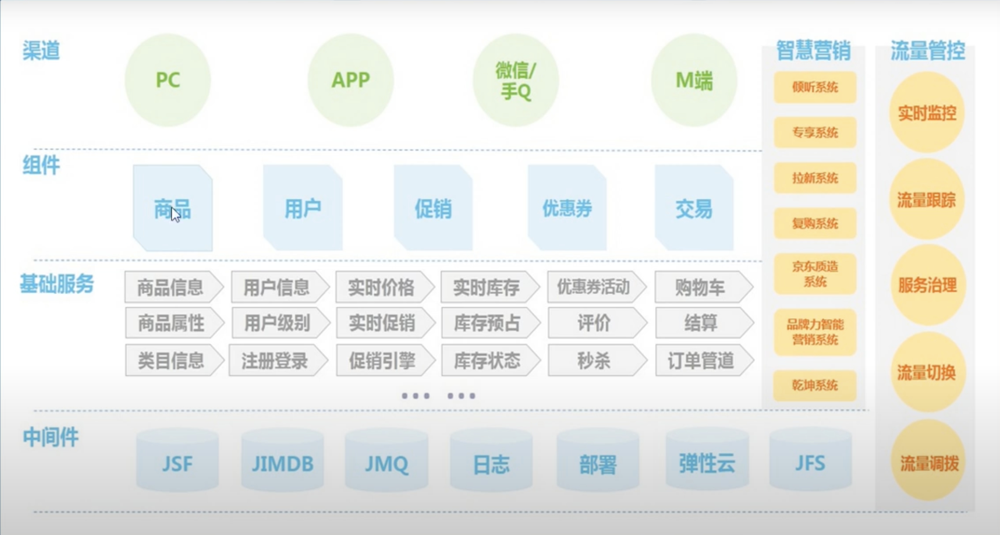
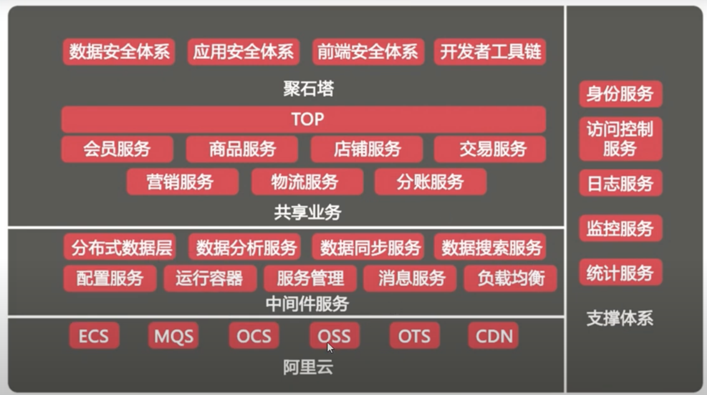

# Spring Cloud

## **微服务**

是一种[软件架构风格](https://zh.wikipedia.org/wiki/%E8%BD%AF%E4%BB%B6%E6%9E%B6%E6%9E%84)，它是以专注于单一责任与功能的小型功能区块 \(Small Building Blocks\) 为基础，利用模块化的方式组合出复杂的大型应用程序，各功能区块使用与语言无关 \(Language-Independent/Language agnostic\) 的 API 集相互通信。

微服务的起源是由Peter Rodgers博士于 2005 年度云计算博览会提出的微Web服务 \(Micro-Web-Service\) 开始，Juval Löwy 则是与他有类似的前导想法，将类别变成细粒服务 \(granular services\)，以作为Microsoft下一阶段的软件架构，其核心想法是让服务是由类似 Unix 管道的访问方式使用，而且复杂的服务背后是使用简单URI来开放接口，任何服务，任何细粒都能被开放 \(exposed\)。这个设计在 HP 的实验室被实现，具有改变复杂软件系统的强大力量。

2014年，Martin Fowler与James Lewis共同提出了微服务的概念，定义了微服务是由以单一应用程序构成的小服务，自己拥有自己的行程与轻量化处理，服务依业务功能设计，以全自动的方式部署，与其他服务使用 HTTP API 通信。同时服务会使用最小的规模的集中管理能力，服务可以用不同的编程语言与数据库等组件实现。

## **Spring Cloud**

分布式微服务架构的一站式解决方案，是多种微服务架构落地技术的集合体。

* 服务注册与发现
  * Eureka\(停止更新\)
  * **Zookeeper**
  * **Consul**
  * **Nacos**
* 服务调用
  * Ribbon
  * **LoadBalancer**
  * Feign\(停止更新\)
  * **OpenFeign**
* 服务熔断
* 负载均衡
* 服务降级
  * **Hystrix**\(思想值得学习\)
  * Resilience4j
  * **Sentienl**
* 服务消息队列
* 配置中心管理
* 服务配置
  * Config
  * **Nacos**
* 服务网关
  * Zuul
  * Zuul2
  * **Gateway**
* 服务总线
  * Bus
  * **Nacos**
* 服务监控
* 全链路追踪
* 自动化部署
* 服务定时任务调度操作

### 京东微服务架构

### 阿里微服务框架

