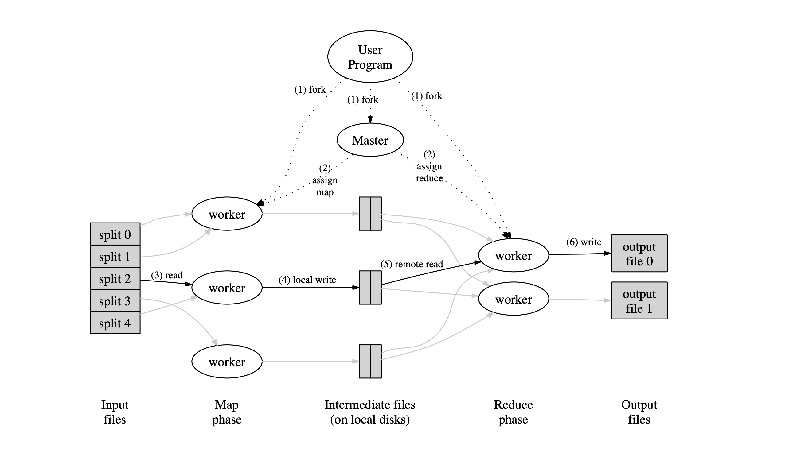

# MapReduce

## 程序设计模型

计算将会以一个键值对集为输入，并且产生一个新键值对集为输出。MapReduce库将计算表示为两个功能：**Map**和**Reduce**。

* **Map：**由用户实现，将输入的键值对集处理成中间量键值对集，MapReduce库将中间量键值对集中具有相同键的键值对都捆绑在一起，将这些捆绑好的数据传给Reduce。
* **Reduce：**由用户实现，从中间量数据中获取键以及每个键对应的值集合。使用Reduce操作将每个键对应这些值转换为一个或零个值。中间量值集合通过迭代器提供数据给reducer，这样让我们可以往内存里塞大量数据。

### 例子

计算大量文件中每个词出现的次数。

```java
map(String key, String value):
    // key: document name
    // value: document contents
    for each word w in value:
    EmitIntermediate(w, "1");

reduce(String key, Iterator values):
    // key: a word
    // values: a list of counts
    int result = 0;
    for each v in values:
    result += ParseInt(v);
    Emit(AsString(result));
```

* map将用于计算每篇文章中，不同词出现的次数。
* reduce将不同文章中的同一个词的出现次数加起来。

### 种类

在前面的伪代码中，输入和输出都是String，但是其实类型是由用户决定的。

```text
map(k1,v1) → list(k2,v2)
reduce(k2,list(v2)) → list(v2)
```

### 更多例子

#### Distributed Grep

The map function emits a line if it matches a supplied pattern. The reduce function is an identity function that just copies the supplied intermediate data to the output.

#### Count of URL Access Frequency

The map function processes logs of web page requests and outputs &lt;URL, 1&gt;. The reduce function adds together all values for the same URL and emits a &lt;URL, total count&gt; pair.

#### Reverse Web-Link Graph

The map function outputs &lt;target, source&gt; pairs for each link to a target URL found in a page named source. The reduce function concatenates the list of all source URLs associated with a given target URL and emits the pair: &lt;target, list\(source\)&gt;.

#### Term-Vector per Host

A term vector summarizes the most important words that occur in a document or a set of documents as a list of &lt;word, frequency&gt; pairs. The map function emits a &lt;hostname, term vector&gt; pair for each input document \(where the hostname is extracted from the URL of the document\). The reduce function is passed all per-document term vectors for a given host. It adds these term vectors together, throwing away infrequent terms, and then emits a final &lt;hostname, term vectori&gt;pair.

#### Inverted Index

The map function parses each document, and emits a sequence of &lt;word, document ID&gt; pairs. The reduce function accepts all pairs for a given word, sorts the corresponding document IDs ,and emits a &lt;word, list\(document ID\)&gt; pair. The set of all output pairs forms a simple inverted index. It is easy to augment this computation to keep track of word positions.

#### Distributed Sort

The map function extracts the key from each record, and emits a &lt;key, record&gt; pair. The reduce function emits all pairs unchanged. 

## 实现

MapReduce适用于不同体量的系统，可以是共享内存的小型机器、大型非均匀访存框架、多个网络化的机器。

Google中的实现是基于大量链接在一起的商用PC组成的cluster。

* 双核x86处理器、2-4GB内存、运行Linux系统。
* 使用100Mbs甚至1Gbs的网络。
* 数百台甚至上千台的机器。
* 便宜的IDE硬盘，用来构建Filesystem，同时提供良好的可靠性和可用性。
* 使用任务提交的scheduling系统，每个scheduler将每一个task分配到具体的集群。

### 运算执行简述

调用Map将输入的数据分配到多个机器当中，使得数据可以并行被对台机器处理。




**参考资料：**

* \*\*\*\*[**MapReduce: Simplified Data Processing on Large Clusters**](http://static.googleusercontent.com/media/research.google.com/zh-CN/us/archive/mapreduce-osdi04.pdf)\*\*\*\*

\*\*\*\*

